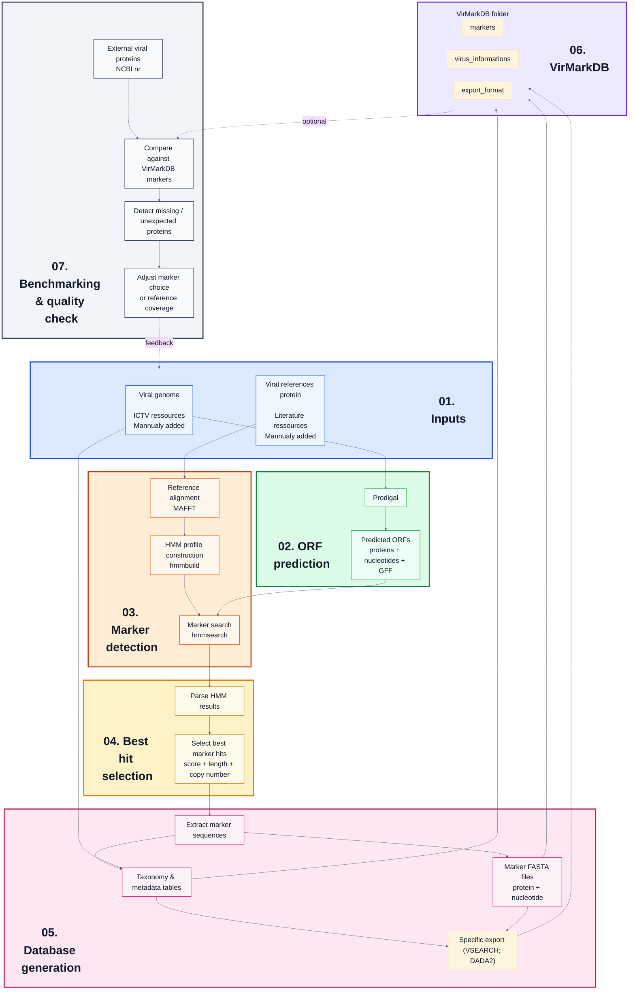

# VirMarkDB

**VirMarkDB** is a reference database of **marker-gene sequences** (**protein + nucleotide**) for viruses. To date only marker-gene for **Nucleocytoviricota** within **Bamfordvirae** are available.  

It is intended for **taxonomic assignment**, **marker-based phylogeny**, and more broadly for workflows that require curated reference sets of conserved viral proteins.

This repository documents **how the database was generated**, **how marker-specific HMM profiles were built and applied**, and **how the database was refined through a benchmark step** designed to detect missing or underrepresented diversity.

The final curated release of the database is distributed separately through [**Zenodo link**](https://zenodo.org/).

---

## 1) Database content

### 1.1 Taxonomic scope

Current taxonomic scope:

| Kingdom | Phylum |
|---|---|
| `Bamfordvirae` | `Nucleocytoviricota` |

Taxonomy from **Kingdom** to **Species** is mainly derived from ICTV resources.

---


### 1.2 Marker genes included

The current database includes the following marker sets:

| Marker | Description | Nucleocytoviricota |
|---|---|---|
| `majorcapsid` | Major capsid protein / MCP | **X** |
| `dnapol` | DNA polymerase B | **X** |
| `atpase` | Packaging ATPase | **X** |
| `primase` | Primase | **X** |
| `rnapol1` | RNA polymerase subunit 1 | **X** |
| `rnapol2` | RNA polymerase subunit 2 | **X** |
| `tf2s` | Transcription factor S-II / TFIIS-like marker | **X** |
| `vltf3` | Viral late transcription factor 3 | **X** |

---

### 1.3 Marker groups and taxon-aware HMM profiles

VirMarkDB uses **taxon-aware HMM profiles** defined at the `marker_group_id` level.

Each `marker_group_id` links:
- one marker gene,
- one taxonomic scope,
- one corresponding HMM profile.

This structure allows the same marker, for example `majorcapsid` or `dnapol`, to be represented by different HMM profiles when sequence divergence between viral lineages is too high for a single universal model.

Marker groups are defined in: [`input/mapfile.tsv`](input/mapfile.tsv)

---

### 1.4 General statistics

The table below summarizes the number of viral genomes represented by family and marker group.

|Family            | atpase| dnapol| majorcapsid| primase| rnapol1| rnapol2| tf2s| vltf3|
|:-----------------|------:|------:|-----------:|-------:|-------:|-------:|----:|-----:|
|Allomimiviridae   |      4|      5|           3|       4|       4|       5|    4|     5|
|Ascoviridae       |      5|      5|           6|       5|       5|       5|    5|     5|
|Asfarviridae      |     20|     20|          20|      20|      20|      20|   20|    20|
|Hydriviridae      |      0|      1|           1|       1|       1|       1|    1|     1|
|Iridoviridae      |     52|     52|          55|      52|      52|      52|   47|    52|
|Mamonoviridae     |      2|      2|           2|       2|       0|       0|    2|     1|
|Marseilleviridae  |      4|      4|           4|       5|       3|       3|    4|     4|
|Mesomimiviridae   |      5|      6|           6|       6|       6|       6|    6|     6|
|Mimiviridae       |     20|     20|          20|      20|      20|      20|   20|    20|
|Orpheoviridae     |      0|      1|           1|       1|       1|       1|    1|     1|
|Phycodnaviridae   |     29|     26|          29|      30|       1|       1|   26|    28|
|Pithoviridae      |      0|     13|          13|      13|      13|      13|   13|    13|
|Poxviridae        |     52|     53|          21|      49|      53|      53|   45|     2|
|Schizomimiviridae |      2|      2|           2|       2|       2|       2|    2|     2|
|Yaraviridae       |      1|      0|           1|       0|       0|       0|    0|     0|
|Total genomes     |    196|    210|         184|     210|     181|     182|  196|   160|

---


## 2) Repository layout

```bash
.
├── input/
│   ├── manual_genomes_ncbi.tsv
│   ├── manual_reference_protein/
│   ├── mapfile.tsv
│   └── ncbi.creds          # private credentials (line 1: email, line 2: NCBI API key)
├── output/
│   ├── benchmark/
│   ├── config/
│   ├── genomes/
│   ├── hmm/
│   ├── orfs/
│   ├── reference_sources/
│   ├── references_protein/
│   └── VirMarkDB/
│       ├── export_format/
│       ├── markers/
│       └── virus_informations/
├── scripts/
│   ├── benchmarking/
│   ├── database_generation/
│   └── utils/
├── make.bash
└── README.md
```

---

## 3) Workflow overview 



## 4) Input and provenance

### 4.1 ICTV resources

The workflow uses the [**ICTV Virus Metadata Resource VMR_MSL41.v1.20260320**](https://ictv.global/sites/default/files/VMR/VMR_MSL41.v1.20260320.xlsx), released on **2026-03-20**, to build the initial genome manifest and associated taxonomy.

The VMR provides virus names, ICTV identifiers, taxonomy fields from `Kingdom` to `Species`, GenBank accession information, genome composition and host source metadata.

---

### 4.2 Additional genome inputs

The workflow incorporates manually added genomes:[`input/manual_genomes_ncbi.tsv`](input/manual_genomes_ncbi.tsv).

These additions are merged with ICTV-derived entries in the final manifest: `output/config/manifest_genomes.tsv`.

---

### 4.3 Reference protein sources

Marker HMM profiles are built from marker-group-specific reference protein sets stored in [`output/references_protein/`](output/references_protein/).

Reference proteins come from three complementary source types:

- published reference datasets,
- manually curated protein accessions,
- benchmark-guided additions used to improve marker coverage.

| Taxonomic scope | Marker groups | Reference source | Source type | Notes |
|---|---|---|---|---|
| `Nucleocytoviricota` | `majorcapsid`, `dnapol`, `atpase`, `primase`, `rnapol1`, `rnapol2`, `tf2s`, `vltf3` | [Guglielmini et al. 2019 Zenodo repository](https://zenodo.org/record/3368642) | Published reference dataset | Initial conserved NCLDV marker-protein reference set |
| `Nucleocytoviricota` | `majorcapsid`, `dnapol` | manual accessions | Manual curation | Added when a known marker was missing or poorly represented |

---

## 5) General workflow

### 5.1 Database generation

#### 5.1.1 ORF prediction

ORFs are predicted from each genome using **Prodigal** in metagenomic mode (`-p meta`).

This step is performed by [`02_prodigal.bash`](scripts/database_generation/02_prodigal.bash).

#### 5.1.2 Reference alignment and HMM construction

Marker-group-specific reference proteins are aligned with **MAFFT** using the options `--ep 0 --genafpair`.

This step is performed by [`03_align_markers.bash`](scripts/database_generation/03_align_markers.bash).

Filtered alignments are then converted into HMM profiles with **HMMER hmmbuild**.

This step is performed by [`04_hmmbuild.bash`](scripts/database_generation/04_hmmbuild.bash).

#### 5.1.3 HMM search

Predicted ORF proteomes are searched with **hmmsearch**.

This step is performed by [`05_hmmsearch.bash`](scripts/database_generation/05_hmmsearch.bash).

Each genome is searched only against the HMM profiles assigned to it through `genome_marker_map.tsv`.

#### 5.1.4 Predicted protein selection

For each `(virus_id, marker_group_id)` pair, HMM hits are ranked first by increasing e-value and then by decreasing bit score.

The final selection always keeps the best-ranked hit for each `(virus_id, marker_group_id)` pair. Additional hits are retained only when they are close to the best hit in both score and ORF length.

This step is performed by [`06_final_results.R`](scripts/database_generation/06_final_results.R).

Default filters for additional copies:

```text
score ratio  >= 0.80 relative to the best hit for this marker group and genome
length ratio >= 0.80 relative to the best hit for this marker group and genome
```

This filtering step is designed to keep credible additional copies while removing weak secondary hits.

---

### 5.2 Benchmark-guided refinement

VirMarkDB was evaluated against a broader **Bamfordvirae protein pool** extracted from a local **NCBI NR** database.

The purpose of this benchmark is to detect marker diversity that is missing or underrepresented in the current database.

| Step | Description | Script |
|---:|---|---|
| 1 | Extract a broader Bamfordvirae protein pool from NR and split proteins by marker using title-based filters. | [`07_scrap_viral_protein_ncbi.bash`](scripts/benchmarking/07_scrap_viral_protein_ncbi.bash) |
| 2 | Self-align each marker pool to identify isolated or suspicious protein sequences. | [`08_align_pool_vs_pool.bash`](scripts/benchmarking/08_align_pool_vs_pool.bash) |
| 3 | Analyse marker pool self-alignments and filter likely misannotated proteins. | [`09_results_align_pool_vs_pool.R`](scripts/benchmarking/09_results_align_pool_vs_pool.R) |
| 4 | Compare the filtered external protein pool against the current VirMarkDB marker database. | [`10_align_pool_VirMarkDB.bash`](scripts/benchmarking/10_align_pool_VirMarkDB.bash) |
| 5 | Identify proteins not covered by the current VirMarkDB database. | [`11_analyse_results_align_pool_VirMarkDB.R`](scripts/benchmarking/11_analyse_results_align_pool_VirMarkDB.R) |
| 6 | Cluster missing proteins with **CD-HIT** to reduce redundancy. | [`12_cluterise_missing_prot.bash`](scripts/benchmarking/12_cluterise_missing_prot.bash) |

---

## 6) Output database structure

The database is generated locally in:

```bash
output/VirMarkDB/
```

For public use, the curated release will be distributed through the Zenodo archive linked at the top of this README.

The local output folder contains three main components:

| Folder | Content | Role in the database |
|---|---|---|
| `markers/` | Retained marker ORF sequences and per-marker ORF description tables | Consolidated output of the HMM-based marker detection step |
| `virus_informations/` | Genome metadata and wide marker-composition tables | Links retained ORFs to virus names, ICTV identifiers and taxonomy |
| `export_format/` | Reformatted FASTA and taxonomy files | Tool-specific exports derived from the curated marker database |

---

### 6.1 Marker detection outputs

Marker-specific outputs are organised by taxonomic group and marker name:

```bash
output/VirMarkDB/markers/<group_id>/<marker>/
```

Each marker-group folder contains the retained ORFs for one `marker_group_id`.

| File | Description |
|---|---|
| `<marker_group_id>_protein.fasta` | Protein sequences of the retained ORFs for this marker group |
| `<marker_group_id>_nucleotide.fasta` | Nucleotide sequences corresponding to the retained ORFs |
| `<marker_group_id>_virus_orf_description.tsv` | Per-ORF table describing the retained HMM hits and their associated virus metadata |

These files are the main curated marker outputs produced after HMM search and best-hit selection.

Protein FASTA headers follow this structure:

```text
>orf_name marker Kingdom;Phylum;Class;Order;Family;Genus;Species
```

Example:

```text
>AF012825.2_156 atpase Bamfordvirae;Nucleocytoviricota;...;Species_name
```

Terminal stop characters (`*`) are removed from exported protein sequences when present.

---

### 6.2 Marker ORF description tables

Each `<marker_group_id>_virus_orf_description.tsv` file describes the ORFs retained for one marker group.

| Column | Description |
|---|---|
| `orf_name` | ORF identifier from the Prodigal-predicted ORF FASTA |
| `virus_id` | Genome identifier matched to the manifest |
| `group_id` | Taxonomic group used to define the marker group |
| `marker` | Marker name |
| `copy_rank` | Rank of the ORF among hits for the same genome and marker group |
| `evalue` | HMMER e-value of the retained hit |
| `score` | HMMER bit score of the retained hit |
| `best_score` | Best HMMER score for this genome and marker group |
| `score_ratio` | ORF score divided by the best score for this genome and marker group |
| `target_length_aa` | Predicted ORF length in amino acids |
| `best_orf_length` | Length of the best-ranked ORF for this genome and marker group |
| `length_ratio` | ORF length divided by the best ORF length |
| `position_start` | ORF start coordinate from the Prodigal description |
| `position_end` | ORF end coordinate from the Prodigal description |
| `Species` | ICTV species name |
| `Virus_names` | Virus name from the ICTV VMR |

The first-ranked ORF is always retained. Additional ORFs are retained only when they pass the score and length ratio thresholds defined during predicted protein selection.

---

### 6.3 Virus information tables

Genome-level database tables are written to:

```bash
output/VirMarkDB/virus_informations/
```

| File | Description |
|---|---|
| `virus_compo_taxo.tsv` | Wide-format table linking each genome to the ORFs retained for each marker group |
| `virus_metadata.tsv` | Genome-level metadata table derived from the manifest |

`virus_compo_taxo.tsv` is the main composition table. It reports, for each genome, the retained ORF names for each marker group. When several ORFs are retained for the same genome and marker group, ORF names are separated by semicolons.

Example structure:

```text
virus_id | ICTV_ID | Virus_names | atpase_nucleocytoviricota_orf_names | dnapol_nucleocytoviricota_orf_names | ...
```

`virus_metadata.tsv` stores contextual information for genomes represented in the database, including:

- `virus_id`,
- `ICTV_ID`,
- `Virus_names`,
- `Virus_names_abrv`,
- `Host_source`,
- `Origin_source`,
- taxonomy fields from `Kingdom` to `Species`.

---

### 6.4 Tool-specific exports

Tool-specific exports are written to:

```bash
output/VirMarkDB/export_format/
```

These files are derived from the curated marker outputs and are provided only to make the database easier to reuse in common sequence-assignment workflows.

| Folder | Content |
|---|---|
| `vsearch/` | FASTA files with simplified sequence identifiers and a separate taxonomy table |
| `dada2/` | Training FASTA files formatted for DADA2 taxonomy-assignment functions |

The VSEARCH export separates sequence identifiers and taxonomy into FASTA files plus a `taxonomy.tsv` file.

The DADA2 export rewrites FASTA headers into taxonomy strings expected by DADA2 training-set functions.

---

## 7) Software used

The workflow relies on:

| Tool | Version |
|---|---|
| **R** | `4.4.1` |
| **Prodigal** | `2.6.3` |
| **MAFFT** | `7.525` |
| **HMMER** | `3.3.2` |
| **BLAST+** | `2.16.0` |
| **MMseqs2** | `15.6f452` |
| **CD-HIT** | `4.8.1` |

---

## 8) Notes and limitations

- ORF prediction was performed with Prodigal, which is practical and robust, but viral genomes can still contain coding configurations that are difficult to predict.
- HMM profile performance depends strongly on the diversity and quality of the seed reference sets.
- HMMs are currently handled at the marker-group level and are therefore specific to defined taxonomic scopes.
- `NA` values in marker presence tables mean not detected or not retained under the current workflow and thresholds, not automatically true biological absence.
- The benchmark filtering strategy is empirical and was designed as a practical way to clean large external protein pools before coverage assessment.
- The current database focuses on Nucleocytoviricota. Additional viral groups can be added later if suitable marker references and genome mappings are available.


The number of genomes in the manifest (from ICTV) and the number of genomes with selected marker ORFs can differ.

A genome present in the manifest but absent from marker FASTA exports should not be interpreted automatically as missing from the pipeline.  
It can simply mean that no ORF passed the current HMM and filtering steps.


---

## 9) Recommended citation and license

To be completed when the public archive is deposited.

Suggested placeholders:

- **Database citation:** `[CITATION]`
- **License:** `[LICENSE]`

---

## 10) References

### ICTV resources

- ICTV Virus Metadata Resource: [**ICTV Virus Metadata Resource VMR_MSL41.v1.20260320**](https://ictv.global/sites/default/files/VMR/VMR_MSL41.v1.20260320.xlsx)

### Reference datasets and literature

- [Guglielmini et al. 2019 ](https://doi.org/10.1073/pnas.1912006116), on Diversification of giant and large eukaryotic dsDNA viruses predated the origin of modern eukaryotes.
- Associated [Zenodo](https://zenodo.org/record/3368642) supplementary data deposit used as one of the reference sources.

---

## 11) Contact / issues

This repository documents the generation and refinement of the VirMarkDB database.

Potential uses of the issue tracker include:

- suspicious marker assignments,
- missing taxa or poorly represented lineages,
- requests for additional marker groups,
- questions about workflow provenance or reproducibility.

Contributions, corrections and suggestions are welcome.