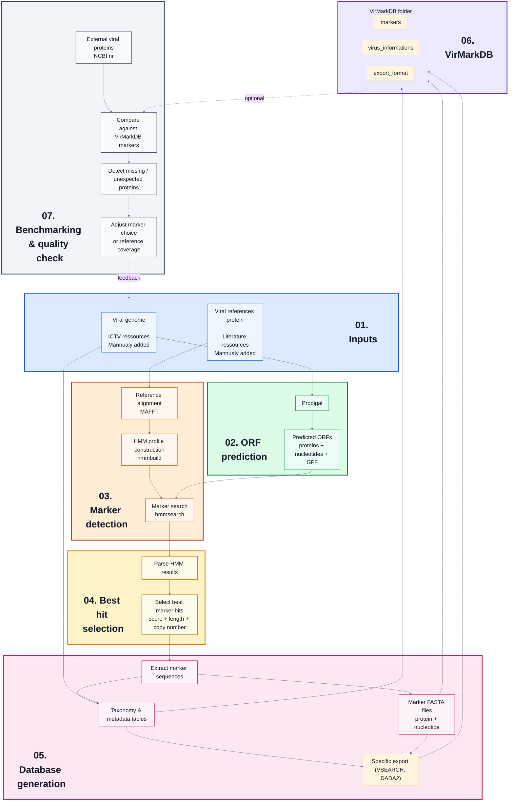

# VirMarkDB

**VirMarkDB** is a reference database of **marker-gene sequences** (**protein + nucleotide**) for viruses. To date only marker-gene for **Nucleocytoviricota** within **Bamfordvirae** are available.  
It is intended for **taxonomic assignment**, **marker-based phylogeny**, and more broadly for workflows that require curated reference sets of conserved viral proteins.

This repository documents **how the database was generated**, **how marker-specific HMM profiles were built and applied**, and **how the database was refined through a benchmark step** designed to detect missing or underrepresented diversity.

The final curated release of the database is distributed separately through [**Zenodo link**][https://zenodo.org/].

---

## 1) Database content

### 1.1 Taxonomic scope

Current taxonomic scope:

| Kingdom | Phylum |
|---|---|
| `Bamfordvirae` | `Nucleocytoviricota` |

Taxonomy from **Kingdom** to **Species** is mainly derived from ICTV resources.

---


### 1.2 Marker genes included

The current database includes the following marker sets:

| Marker | Description | Nucleocytoviricota |
|---|---|---|
| `majorcapsid` | Major capsid protein / MCP | **X** |
| `dnapol` | DNA polymerase B | **X** |
| `atpase` | Packaging ATPase | **X** |
| `primase` | Primase | **X** |
| `rnapol1` | RNA polymerase subunit 1 | **X** |
| `rnapol2` | RNA polymerase subunit 2 | **X** |
| `tf2s` | Transcription factor S-II / TFIIS-like marker | **X** |
| `vltf3` | Viral late transcription factor 3 | **X** |

---

### 1.3 Marker groups and taxon-aware HMM profiles

HMM profiles are handled at the **`marker_group_id`** level.

A `marker_group_id` corresponds to one marker within a defined taxonomic scope.  
This means that the same broad marker can have several HMM profiles if different taxonomic groups need different reference spaces.

In practice:

- marker groups are defined in `marker_taxo_map.tsv`,
- genomes are linked to expected marker groups in `genome_marker_map.tsv`,
- and each genome is searched only against the HMM profiles assigned to its taxonomic group.

This avoids forcing one universal HMM profile onto all lineages when the marker is too divergent across the phylum.

---

### 1.4 General statistics

The table below summarizes the number of viral genomes represented by family and marker group.

`n_marker_genome_total` is the row total across marker groups.  
It corresponds to the sum of marker-positive genome counts across markers, not to the number of unique genomes.

|Family            | atpase| dnapol| majorcapsid| primase| rnapol1| rnapol2| tf2s| vltf3|
|:-----------------|------:|------:|-----------:|-------:|-------:|-------:|----:|-----:|
|Allomimiviridae   |      4|      5|           3|       4|       4|       5|    4|     5|
|Ascoviridae       |      5|      5|           6|       5|       5|       5|    5|     5|
|Asfarviridae      |     20|     20|          20|      20|      20|      20|   20|    20|
|Hydriviridae      |      0|      1|           1|       1|       1|       1|    1|     1|
|Iridoviridae      |     52|     52|          55|      52|      52|      52|   47|    52|
|Mamonoviridae     |      2|      2|           2|       2|       0|       0|    2|     1|
|Marseilleviridae  |      4|      4|           4|       5|       3|       3|    4|     4|
|Mesomimiviridae   |      5|      6|           6|       6|       6|       6|    6|     6|
|Mimiviridae       |     20|     20|          20|      20|      20|      20|   20|    20|
|Orpheoviridae     |      0|      1|           1|       1|       1|       1|    1|     1|
|Phycodnaviridae   |     29|     26|          29|      30|       1|       1|   26|    28|
|Pithoviridae      |      0|     13|          13|      13|      13|      13|   13|    13|
|Poxviridae        |     52|     53|          21|      49|      53|      53|   45|     2|
|Schizomimiviridae |      2|      2|           2|       2|       2|       2|    2|     2|
|Yaraviridae       |      1|      0|           1|       0|       0|       0|    0|     0|
|Total genomes     |    196|    210|         184|     210|     181|     182|  196|   160|

---


## 2) Repository layout

```bash
.
├── input/
│   ├── manual_genomes_ncbi.tsv
│   ├── manual_reference_protein/
│   ├── mapfile.tsv
│   └── ncbi.creds
├── output/
│   ├── benchmark/
│   ├── config/
│   ├── genomes/
│   ├── hmm/
│   ├── orfs/
│   ├── reference_sources/
│   ├── references_protein/
│   └── VirMarkDB/
│       ├── export_format/
│       ├── markers/
│       └── virus_informations/
├── scripts/
│   ├── analysis/
│   └── utils/
├── make.bash
└── README.md
```

---

## 3) Workflow overview 



## 4) Input and provenance

### 4.1 ICTV resources

The workflow uses ICTV resources to build the initial genome manifest and taxonomy.

The current scripts use:

- ICTV Virus Metadata Resource,
- taxonomy fields from `Kingdom` to `Species`,
- GenBank accession information associated with ICTV virus entries.

---

### 4.2 Additional genome inputs

The workflow incorporates manually added genomes:

```bash
input/manual_genomes_ncbi.tsv
```

These additions are merged with ICTV-derived entries in the final manifest:

```bash
output/config/manifest_genomes.tsv
```

---

### 4.3 Reference protein sources

Marker HMM profiles are built from marker-group-specific reference protein sets stored in:

```bash
output/references_protein/
```

These reference sets combine:

- sequences derived from external reference resources,
- manually curated protein accessions,
- and benchmark-guided additions when needed.

The repository also documents the use of an external Zenodo protein resource during reference preparation.

---

## 5) Database generation

### 5.1 Manifest generation

The manifest step extracts viral entries from ICTV tables, normalizes accession information and merges optional manual additions.

Main outputs:

```bash
output/config/manifest_genomes.tsv
output/config/marker_taxo_map.tsv
output/config/genome_marker_map.tsv
```

`manifest_genomes.tsv` is the central genome table.  
`marker_taxo_map.tsv` defines marker groups and their taxonomic scope.  
`genome_marker_map.tsv` expands the expected genome × marker combinations.

---

### 5.2 Genome retrieval / preparation

Genome FASTA files are gathered in:

```bash
output/genomes/
```

This can include:

- downloaded NCBI genomes,
- copied private genomes,
- manually declared genome additions.

---

### 5.3 ORF prediction

ORFs are predicted from each genome using **Prodigal** in metagenomic mode:

```bash
-p meta
```

Outputs:

```bash
output/orfs/*.faa
output/orfs/*.fna
output/orfs/*.gff
```

---

### 5.4 Reference alignment and HMM construction

Marker-group-specific reference proteins are aligned with **MAFFT** and filtered with **trimAl**.

Alignment outputs:

```bash
output/hmm/aln/
output/hmm/aln_filt/
```

Filtered alignments are converted into HMM profiles with **HMMER hmmbuild**.

HMM outputs:

```bash
output/hmm/hmms/
```

---

### 5.5 HMM search

Predicted ORF proteomes are searched with **hmmsearch**.

Importantly, each genome is searched only against the HMM profiles assigned to it through:

```bash
output/config/genome_marker_map.tsv
```

HMM search outputs:

```bash
output/hmm/search/
```

---

### 5.6 Best-hit selection

For each `(virus_id, marker_group_id)` pair, HMM hits are ranked first by increasing e-value and then by decreasing bit score.

The final selection always keeps the best-ranked hit for each `(virus_id, marker_group_id)` pair. Additional hits are retained only when they are close to the best hit in both score and ORF length.

Default filters for additional copies:

```text
score ratio  >= 0.80 relative to the best hit for this marker group and genome
length ratio >= 0.80 relative to the best hit for this marker group and genome
```

This filtering step is designed to keep credible additional copies while removing weak secondary hits. It should not be interpreted as a dedicated fragmented-ORF recovery procedure.

---

## 6) Final database outputs

The final exported database is written to:

```bash
output/VirMarkDB/
```

It contains:

```bash
output/VirMarkDB/markers/
output/VirMarkDB/virus_informations/
output/VirMarkDB/export_format/
```

---

### 6.1 Marker folders

Marker FASTA files are organized as:

```bash
output/VirMarkDB/markers/<group_id>/<marker>/
```

Each marker-group folder contains:

```bash
<marker_group_id>_protein.fasta
<marker_group_id>_nucleotid.fasta
<marker_group_id>_virus_orf_description.tsv
```

The description table contains the selected ORF information, including:

- `virus_id`,
- `group_id`,
- `marker`,
- `marker_group_id`,
- `orf_name`,
- `evalue`,
- `score`,
- `copy_rank`,
- `score_ratio`,
- `length_ratio`,
- `position_start`,
- `position_end`,
- `Species`,
- `Virus_names`.

---

### 6.2 Global virus tables

Global summary tables are written to:

```bash
output/VirMarkDB/virus_informations/
```

Main files:

```bash
virus_compo_taxo.tsv
virus_metadata.tsv
```

`virus_compo_taxo.tsv` is the main wide-format marker composition table.  
It reports, for each genome, the retained ORF names and number of copies for each marker group.

`virus_metadata.tsv` stores genome-level metadata:

- `virus_id`,
- `ICTV_ID`,
- `Virus_names`,
- `Virus_names_abrv`,
- `Host_source`,
- `Origin_source`,
- taxonomy from `Kingdom` to `Species`.

`Origin_source` indicates how the genome entered the workflow, for example through ICTV-derived entries, manual NCBI additions or private genome additions.

---

### 6.3 Note on genome counts

The number of genomes in the manifest (from ICTV) and the number of genomes with selected marker ORFs can differ.

A genome present in the manifest but absent from marker FASTA exports should not be interpreted automatically as missing from the pipeline.  
It can simply mean that no ORF passed the current HMM and filtering steps.

---

### 6.4 Tool-specific exports

Additional exports are written to:

```bash
output/VirMarkDB/export_format/
```

Current export targets include:

- `vsearch`,
- `dada2`.

---

## 7) Benchmark-guided refinement

The database was also evaluated against a broader Bamfordvirae protein pool extracted from a local **NR** database.

The purpose of this benchmark was to detect missing or underrepresented marker diversity.

Main benchmark steps:

1. extract a broader Bamfordvirae protein pool from NR;
2. split proteins by marker using title-based filters;
3. self-align each marker pool to remove isolated or suspicious sequences;
4. compare the filtered pool against the current VirMarkDB marker database;
5. identify proteins not covered by the current database;
6. cluster missing proteins with CD-HIT to reduce redundancy.

---

## 8) Software used

The workflow relies on:

| Tool | Version |
|---|---|
| **R** | `4.4.1` |
| **Prodigal** | `2.6.3` |
| **MAFFT** | `7.525` |
| **trimAl** | `1.5.0` |
| **HMMER** | `3.3.2` |
| **BLAST+** | `2.16.0` |
| **MMseqs2** | `15.6f452` |
| **CD-HIT** | `4.8.1` |

---

## 10) Notes and limitations

- ORF prediction was performed with Prodigal, which is practical and robust, but viral genomes can still contain coding configurations that are difficult to predict.
- HMM profile performance depends strongly on the diversity and quality of the seed reference sets.
- HMMs are currently handled at the marker-group level and are therefore specific to defined taxonomic scopes.
- `NA` values in marker presence tables mean not detected or not retained under the current workflow and thresholds, not automatically true biological absence.
- The benchmark filtering strategy is empirical and was designed as a practical way to clean large external protein pools before coverage assessment.
- The current database focuses on Nucleocytoviricota. Additional viral groups can be added later if suitable marker references and genome mappings are available.

---

## 13) Recommended citation and license

To be completed when the public archive is deposited.

Suggested placeholders:

- **Database citation:** `[CITATION]`
- **License:** `[LICENSE]`

---

## 14) References

### ICTV resources

- ICTV Master Species Lists
- ICTV Virus Metadata Resource

### Reference datasets and literature

- Guglielmini et al. (2019), on large and giant eukaryotic dsDNA viruses
- Associated Zenodo supplementary data deposit used as one of the reference sources

---

## Contact / issues

This repository documents the generation and refinement of the VirMarkDB database.

Potential uses of the issue tracker include:

- suspicious marker assignments,
- missing taxa or poorly represented lineages,
- requests for additional marker groups,
- questions about workflow provenance or reproducibility.

Contributions, corrections and suggestions are welcome.