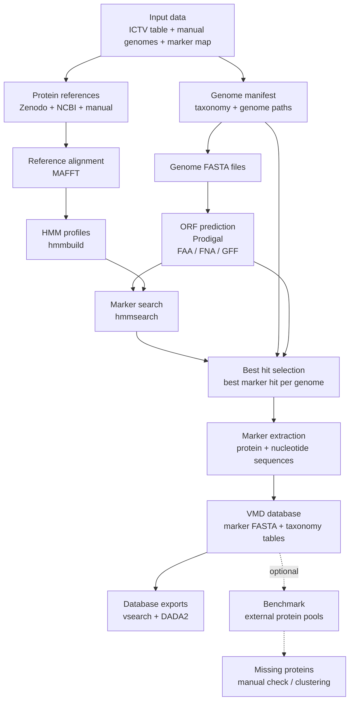

# VMD - Viral Marker Database (for Bamfordvirae dsDNA Viruses)

**VMD** is a reference database of **marker-gene sequences** (**protein + nucleotide**) for dsDNA viruses within **Bamfordvirae**.  
It is intended for **taxonomic assignment**, **marker-based phylogeny**, and more broadly for workflows that require curated reference sets of conserved viral proteins.

This repository documents **how the database was generated**, **how marker-specific HMM profiles were built and applied**, and **how the database was refined through a benchmark step** designed to detect missing or underrepresented diversity.

The final curated release of the database is meant to be distributed separately through a **public archive** (for example Zenodo).

---

## Public archive

- **Archive / Zenodo:** `[LINK]`
- **DOI:** `[LINK]`

---

## 1) What is inside?

### 1.1 Taxonomic scope

- **Kingdom:** `Bamfordvirae`
- Taxonomy from **Kingdom** to **Species** is derived from the ICTV resources used during the build.

### 1.2 Marker genes included

The database currently includes the following marker sets:

| Marker | Description |
|---|---|
| `majorcapsid` | Major capsid protein (MCP) / capsid morphogenesis |
| `dnapol` | DNA polymerase B / replication |
| `atpase` | Packaging ATPase / virion assembly |
| `primase` | Primase / replication initiation |
| `rnapol1` | RNA polymerase subunit 1 |
| `rnapol2` | RNA polymerase subunit 2 |
| `tf2s` | Transcription factor S-II / TFIIS-like marker |
| `vltf3` | Viral late transcription factor 3 |

### 1.3 Marker groups and taxon-specific HMM profiles

A central feature of the current workflow is that HMM profiles are not handled only at the broad marker level.  
They are handled at the **`marker_group_id`** level.

A `marker_group_id` corresponds to a given marker within a defined **taxonomic scope**.  
In practice, this means that:

- the same broad marker can have **different HMM profiles for different taxonomic groups**,
- genomes are associated with marker groups through a mapping file,
- and each genome is searched only against the HMM profiles relevant to its assigned taxonomic group(s).

This design was introduced to better represent the diversity of Bamfordvirae markers and to avoid forcing a single universal HMM profile onto lineages that may be too divergent.

### 1.4 Typical use cases

The database can be used for:

- **marker phylogenies** built from curated reference sets,
- **reference FASTA collections** for BLAST, HMM, MMseqs2 or DIAMOND-based workflows,
- **presence/absence summaries** of marker groups across Bamfordvirae genomes,
- **metadata-aware analyses** relying on ICTV taxonomy and accession-linked provenance,
- **tool-specific exports** for workflows such as `vsearch` and `dada2`.

---

## 2) Repository layout

VMD database workflow



The workflow currently relies on the following structure:

```bash
.
├── input/
│   ├── manual_genomes_ncbi.tsv
│   ├── manual_genomes_private.tsv
│   ├── manual_reference_protein/
│   ├── private_genomes/
│   ├── mapfile.tsv
│   ├── ncbi.creds
│   └── ncbi_taxonomy/
├── output/
│   ├── benchmark/
│   │   ├── pool_protein/
│   │   │   ├── pool_protein_raw/
│   │   │   ├── pool_protein_filt/
│   │   │   └── auto_alignment/
│   │   └── alignment_vmd_pool/
│   │       ├── alignment/
│   │       ├── bench_results/
│   │       ├── hits_prot/
│   │       └── missing_prot/
│   ├── config/
│   │   ├── manifest_genomes.tsv
│   │   ├── marker_taxo_map.tsv
│   │   └── genome_marker_map.tsv
│   ├── genomes/
│   ├── hmm/
│   │   ├── aln/
│   │   ├── aln_filt/
│   │   ├── hmms/
│   │   └── search/
│   ├── orfs/
│   ├── reference_sources/
│   ├── references_protein/
│   └── VMD-database/
│       ├── export_format/
│       ├── markers/
│       └── virus_informations/
├── scripts/
│   ├── analysis/
│   └── utils/
├── make.bash
└── README.md
```

### 2.1 Final database location

The final exported database is written to:

```bash
output/VMD-database/
```

It contains three main components:

- `markers/`
- `virus_informations/`
- `export_format/`

### 2.2 Configuration files

The workflow writes configuration and mapping tables to:

```bash
output/config/
```

These include:

- `manifest_genomes.tsv`
- `marker_taxo_map.tsv`
- `genome_marker_map.tsv`

These tables are central to the current workflow because they define:

- which genomes are included,
- which taxonomic groups are targeted,
- which marker groups exist,
- and which HMM profiles should be used for each genome.

### 2.3 Marker folders

The final marker database is organized under:

```bash
output/VMD-database/markers/<group_id>/<marker>/
```

Each exported marker-group folder typically contains:

- `<marker_group_id>_protein.fasta`
- `<marker_group_id>_nucleotid.fasta`
- `<marker_group_id>_virus_orf_description.tsv`

This means that the exported database is structured by:

1. **group_id**
2. **marker**
3. **marker_group_id**

rather than by marker name alone.

### 2.4 Global tables

Global summary tables are written to:

```bash
output/VMD-database/virus_informations/
```

and currently include:

- `virus_compo_taxo.tsv`
- `virus_metadata.tsv`
- `best_hits.tsv`

### 2.5 Tool-specific export formats

Additional exports are written to:

```bash
output/VMD-database/export_format/
```

These currently include dedicated outputs for:

- `vsearch`
- `dada2`

---

## 3) Keys, headers, and traceability

### 3.1 Primary key: `virus_id`

The central key used throughout the workflow is `virus_id`.

In the current build logic, `virus_id` corresponds to the accession identifier propagated through downstream analyses.  
It is used to join:

- ICTV-derived metadata,
- manual genome additions,
- downloaded or copied genome FASTA files,
- predicted ORFs,
- HMM search results,
- and final database exports.

### 3.2 Secondary key: `marker_group_id`

The key used for marker-group resolution is `marker_group_id`.

This identifier links:

- taxonomic scope,
- marker identity,
- HMM profiles,
- HMM search outputs,
- and final per-marker exports.

It is therefore the key that captures the current **taxon-aware marker logic**.

### 3.3 FASTA headers

In the current export logic, marker FASTA headers are built from:

- `virus_id`
- followed by the taxonomic lineage from `Kingdom` to `Species`

This makes exported marker sequences directly traceable to their taxonomic context.

---

## 4) Final database content

### 4.1 `virus_compo_taxo.tsv`

This is the main wide-format summary table of the exported database.

It includes:

- `virus_id`
- `Virus_names`
- `ICTV_ID`
- one column per `marker_group_id`
- taxonomy columns from `Kingdom` to `Species`

For each marker-group column, the stored value corresponds to the **retained ORF name** selected as the best hit for that virus.  
An `NA` means that no hit was retained for that marker group in the current build.

### 4.2 `virus_metadata.tsv`

This table contains the metadata associated with viruses retained in the final exported database.

It includes:

- `virus_id`
- `ICTV_ID`
- `Virus_names`
- `Virus_names_abrv`
- `Host_source`
- `Origin_source`
- taxonomy columns from `Kingdom` to `Species`

`Origin_source` indicates how the genome entered the workflow, for example through ICTV-derived entries, manual NCBI additions, or private genome additions.

### 4.3 `best_hits.tsv`

This table contains the best retained hit for each `(virus_id, marker_group_id)` pair after HMM search parsing and ranking.

It includes the hit-level information used to build the final marker exports, including:

- `virus_id`
- `group_id`
- `marker`
- `marker_group_id`
- `orf_name`
- `evalue`
- `score`
- `prodigal_start`
- `prodigal_end`
- associated taxonomy and metadata fields after joins

### 4.4 Marker-wise folders

For each `marker_group_id`, the database exports:

- a **protein FASTA** of retained hits,
- a **nucleotide FASTA** of retained hits,
- a **TSV table** describing the selected ORFs.

The per-marker-group description table includes:

- `virus_id`
- `group_id`
- `marker`
- `marker_group_id`
- `orf_name`
- `evalue`
- `score`
- `prodigal_start`
- `prodigal_end`
- `Species`
- `Virus_names`

These files provide the sequence layer and the minimal hit-level annotation needed for downstream analyses.

---

## 5) Provenance and source data

This build is derived from several sources.

### 5.1 ICTV resources

The workflow downloads and parses ICTV metadata to build the initial manifest.

The current scripts reference:

- Virus Metadata Resource aligned to **MSL40.v2**
- associated ICTV taxonomy fields from `Kingdom` to `Species`

### 5.2 Additional genome inputs

The workflow can incorporate:

- `input/manual_genomes_ncbi.tsv` for manually added NCBI genomes
- `input/manual_genomes_private.tsv` for manually declared private genomes
- `input/private_genomes/` for local private genome FASTA files

### 5.3 Reference protein sources

The HMM profiles are built from marker-group-specific reference protein sets stored in:

```bash
output/references_protein/
```

These reference sets can combine:

- sequences derived from downloaded reference resources,
- manually curated protein accessions,
- and marker-group-specific manual additions.

### 5.4 External reference source used during preparation

The repository also documents the use of an external Zenodo protein resource during reference preparation.

---

## 6) How the database was built

The build process can be summarized in two major phases:

1. **initial database construction**
2. **benchmark-guided refinement**

This distinction is important: the final database is not only the result of a one-pass marker detection workflow, but also of an additional evaluation phase designed to reveal what the initial database was still missing.

### 6.1 Initial construction

The first phase consisted in generating a structured marker database directly from Bamfordvirae genomes.

Main steps:

1. **Manifest generation**  
   Bamfordvirae entries are extracted from ICTV tables, accession information is normalized, and a consolidated manifest is written to:

   ```bash
   output/config/manifest_genomes.tsv
   ```

   This step also writes:

   - `output/config/marker_taxo_map.tsv`
   - `output/config/genome_marker_map.tsv`

2. **Genome retrieval / preparation**  
   Genome sequences associated with the manifest are gathered in:

   ```bash
   output/genomes/
   ```

   This can include:
   - downloaded NCBI genomes,
   - copied private genomes,
   - and manually declared genome additions.

3. **ORF prediction**  
   ORFs are predicted from each genome using **Prodigal** in metagenomic mode (`-p meta`), generating:

   - protein FASTA files,
   - nucleotide FASTA files,
   - GFF annotation files.

4. **Reference alignment**  
   Marker-group-specific reference proteins are aligned with **MAFFT** and filtered with **trimAl**.  
   Alignments are written to:

   ```bash
   output/hmm/aln/
   output/hmm/aln_filt/
   ```

5. **HMM construction**  
   Filtered alignments are converted into **marker-group-specific HMM profiles** with **HMMER hmmbuild** and written to:

   ```bash
   output/hmm/hmms/
   ```

6. **Marker detection in predicted ORFs**  
   Predicted ORF proteomes are searched with **hmmsearch** using the generated marker-group HMM profiles.  
   Importantly, each genome is searched only against the subset of HMM profiles assigned to it through `genome_marker_map.tsv`.

7. **Best-hit selection and final export**  
   For each `(virus_id, marker_group_id)` pair, the best hit is selected using HMM search ranking and exported as part of the final database structure.

8. **Tool-specific export generation**  
   Additional exports are generated for downstream tools such as `vsearch` and `dada2`.

### 6.2 Why the HMMs are taxon-aware

The current workflow does not assume that a single universal HMM is always appropriate for all lineages carrying a given marker.

Instead:

- marker groups are defined in a mapping file,
- each marker group has a taxonomic scope,
- genomes are mapped to the relevant marker groups,
- and HMM search is restricted accordingly.

This allows the workflow to represent different parts of Bamfordvirae diversity more explicitly and gives better control over how marker detection is performed across divergent clades.

### 6.3 Benchmark-guided refinement

A second phase was used to evaluate the coverage of the initial database against a broader Bamfordvirae protein pool extracted from a local **NR** database.

This benchmark phase had a practical goal:  
**detect the holes in the database**, in other words, identify which parts of marker diversity were still missing or insufficiently represented in the current build.

Main steps:

1. **Extraction of a broader Bamfordvirae protein pool from NR**  
   A local BLAST-enabled NR database is queried using Bamfordvirae taxonomic restriction, and marker candidates are extracted through title-based filtering.

2. **Self-comparison of each marker pool**  
   Each marker pool is aligned against itself with **MMseqs2** to identify isolated, weakly connected, or suspicious sequences.

3. **Filtering of the benchmark pool**  
   Proteins that do not show satisfactory similarity to other members of the same marker pool are removed, producing a cleaner benchmark set.

4. **Comparison of the filtered pool against the current VMD database**  
   The filtered external pool is then aligned against the marker-group sequences already present in the database.

5. **Identification of missing proteins**  
   Proteins that fail to match the current database are extracted as potentially missing diversity.

6. **Clustering of missing proteins**  
   These missing proteins are clustered with **CD-HIT** to reduce redundancy and facilitate downstream review.

### 6.4 Why the benchmark matters

This second phase is central to the history of the database.

It was used to:

- evaluate how much external Bamfordvirae marker diversity was already covered,
- detect proteins not captured by the current database,
- identify underrepresented regions of marker space,
- and improve the reference space used to generate the final release.

In practice, this benchmark step served to **improve the marker reference space indirectly** by revealing what was missing and therefore what needed to be better represented.

---

## 7) Benchmark output layout

The benchmark workflow currently writes results to the following locations.

### 7.1 Pool generation and auto-alignment

```bash
output/benchmark/pool_protein/pool_protein_raw/
output/benchmark/pool_protein/auto_alignment/blast/
output/benchmark/pool_protein/auto_alignment/blast/analysis/
output/benchmark/pool_protein/pool_protein_filt/
```

### 7.2 Alignment of benchmark pool against VMD

```bash
output/benchmark/alignment_vmd_pool/alignment/
output/benchmark/alignment_vmd_pool/bench_results/
output/benchmark/alignment_vmd_pool/hits_prot/
output/benchmark/alignment_vmd_pool/missing_prot/
output/benchmark/alignment_vmd_pool/missing_prot/clustering/
```

These outputs are used to inspect:

- best matches against the current database,
- proteins from the pool already covered by the database,
- proteins still missing from the database,
- and clustered representations of missing diversity.

---

## 8) Workflow summary

The overall execution logic is summarized in:

```bash
make.bash
```

This script records the sequence of operations used during database generation and benchmark evaluation.

### 8.1 Database generation

1. manifest generation and configuration export,
2. genome gathering,
3. ORF prediction,
4. marker-group reference alignment,
5. HMM construction,
6. HMM search on predicted ORFs,
7. export of the VMD database,
8. generation of tool-specific export formats.

### 8.2 Database benchmarking

1. extraction of a Bamfordvirae protein pool from NR,
2. self-alignment of each marker pool,
3. filtering of the pool,
4. comparison of the filtered pool against the VMD marker database,
5. analysis of best hits and missing proteins,
6. clustering of missing candidates.

---

## 9) Software used

The workflow relies on the following tools:

- **R**
- **Prodigal**
- **MAFFT**
- **trimAl**
- **HMMER**
- **BLAST+**
- **MMseqs2**
- **CD-HIT**

Examples of module versions visible in the workflow include:

- `r/4.4.1`
- `prodigal/2.6.3`
- `mafft/7.525`
- `trimal/1.5.0`
- `hmmer/3.3.2`
- `blast/2.16.0`
- `mmseqs2/15.6f452`
- `cd-hit/4.8.1`

---

## 10) Notes and limitations

- **ORF prediction** was performed with Prodigal, which is practical and robust, but viral genomes can still present difficult coding configurations.
- **HMM profile performance** depends strongly on the diversity and quality of the seed reference sets.
- HMMs are currently handled at the **marker-group** level and are therefore **specific to defined taxonomic scopes**, not necessarily universal across all Bamfordvirae lineages.
- The exported database keeps **one retained hit per virus and per marker group** in the main final exports.
- `NA` values in marker presence tables should be interpreted as **not detected under the current workflow and thresholds**, not automatically as true biological absence.
- The benchmark filtering strategy is **empirical** and was designed as a practical way to clean large external protein pools before coverage assessment.
---

## 11) General statistics


---

## 12) Recommended citation and license

To be completed when the public archive is deposited.

Suggested placeholders:

- **Database citation:** `[CITATION]`
- **License:** `[LICENSE]`

---

## 13) References

### ICTV resources
- ICTV Master Species Lists (MSL)
- ICTV Virus Metadata Resource (VMR)

### Core tools used in the workflow
- Prodigal
- MAFFT
- trimAl
- HMMER
- BLAST+
- MMseqs2
- CD-HIT

### Reference datasets and literature
- Guglielmini et al. (2019), on large and giant eukaryotic dsDNA viruses
- Associated Zenodo supplementary data deposit used as one of the reference sources

---

## Contact / issues

This repository is intended to document the generation and refinement of the VMD database.

Potential uses of the issue tracker include:

- suspicious marker assignments,
- missing taxa or poorly represented lineages,
- requests for additional marker groups,
- questions about workflow provenance or reproducibility.

Contributions, corrections, and suggestions are welcome.
