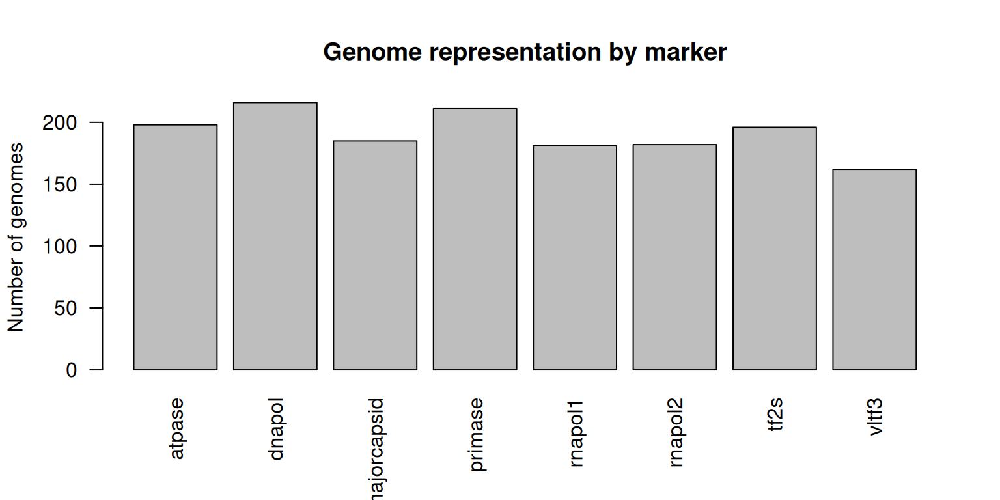
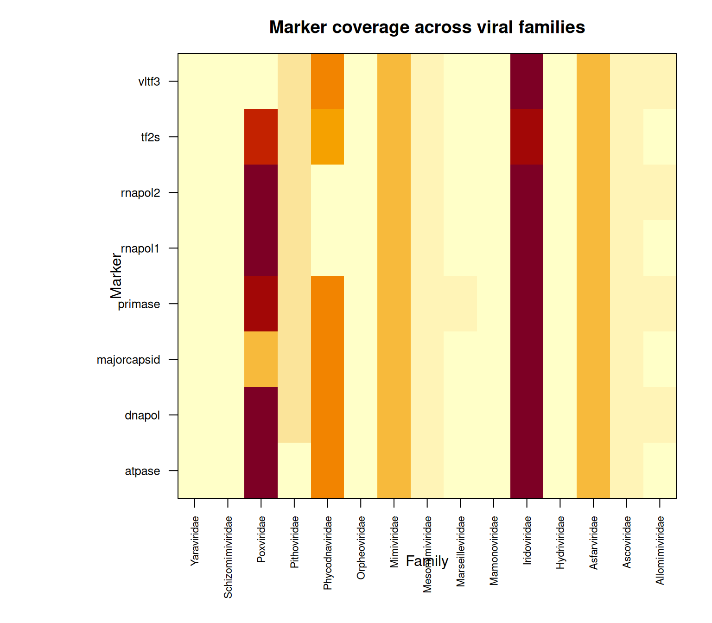
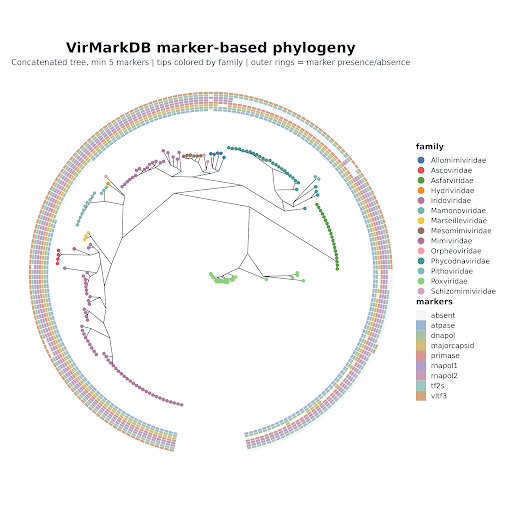

This page is the single reference for coverage numbers and figures. For the underlying concepts, see [Database](database.qmd); for how the data was generated, see [Workflow](workflow.qmd).

## Release summary

::: {.snapshot-grid}

::: {.snapshot-card}
### 8
marker genes
:::

::: {.snapshot-card}
### 15
viral families
:::

::: {.snapshot-card}
### 216
maximum genomes for one marker
:::

:::

## Genome representation by marker

## Coverage heatmap

## Marker coverage by family

| Family | atpase | dnapol | majorcapsid | primase | rnapol1 | rnapol2 | tf2s | vltf3 |
|---|---|---|---|---|---|---|---|---|
| Allomimiviridae | 4 | 5 | 3 | 5 | 4 | 5 | 4 | 5 |
| Ascoviridae | 5 | 6 | 6 | 5 | 5 | 5 | 5 | 5 |
| Asfarviridae | 20 | 20 | 20 | 20 | 20 | 20 | 20 | 20 |
| Hydriviridae | 0 | 1 | 1 | 1 | 1 | 1 | 1 | 1 |
| Iridoviridae | 52 | 52 | 55 | 52 | 52 | 52 | 47 | 52 |
| Mamonoviridae | 2 | 2 | 2 | 2 | 0 | 0 | 2 | 2 |
| Marseilleviridae | 4 | 4 | 4 | 5 | 3 | 3 | 4 | 4 |
| Mesomimiviridae | 6 | 6 | 6 | 6 | 6 | 6 | 6 | 6 |
| Mimiviridae | 20 | 20 | 20 | 20 | 20 | 20 | 20 | 20 |
| Orpheoviridae | 0 | 1 | 1 | 1 | 1 | 1 | 1 | 1 |
| Phycodnaviridae | 29 | 30 | 29 | 30 | 1 | 1 | 26 | 29 |
| Pithoviridae | 0 | 13 | 13 | 13 | 13 | 13 | 13 | 13 |
| Poxviridae | 52 | 54 | 21 | 49 | 53 | 53 | 45 | 2 |
| Schizomimiviridae | 2 | 2 | 2 | 2 | 2 | 2 | 2 | 2 |
| Yaraviridae | 2 | 0 | 2 | 0 | 0 | 0 | 0 | 0 |
| **Total genomes** | **198** | **216** | **185** | **211** | **181** | **182** | **196** | **162** |

::: {.callout-important}
Missing values do not automatically indicate true biological absence. They may reflect incomplete genome sequences, marker divergence, ORF prediction limits, or filtering thresholds. See [About → Notes and limitations](about.qmd#notes-and-limitations).
:::

## Phylogenetic diversity

A phylogenetic tree was generated from a concatenated alignment of the eight marker genes: individual marker alignments produced with MAFFT, trimmed with TrimAl, concatenated, and used for tree inference with IQ-TREE. Only viruses with at least five retained markers were included.

