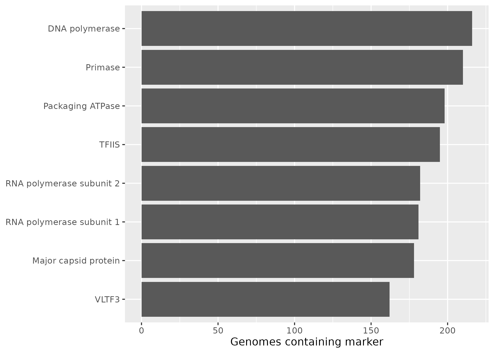
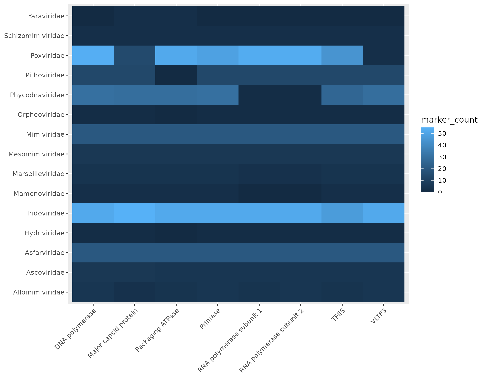
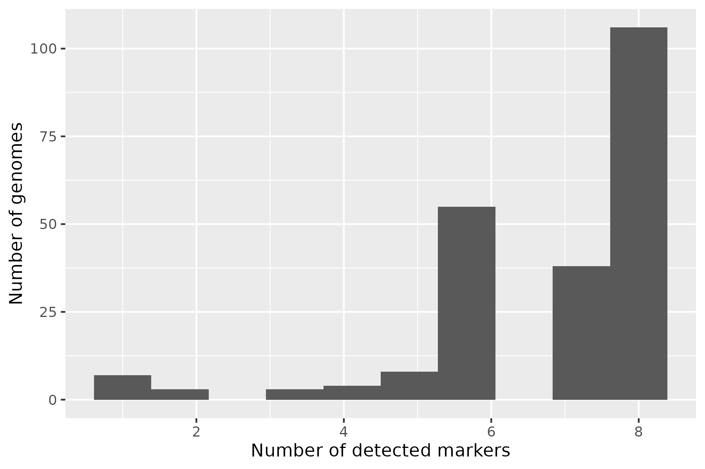
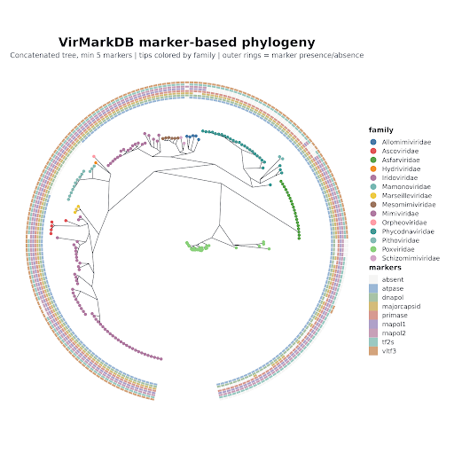
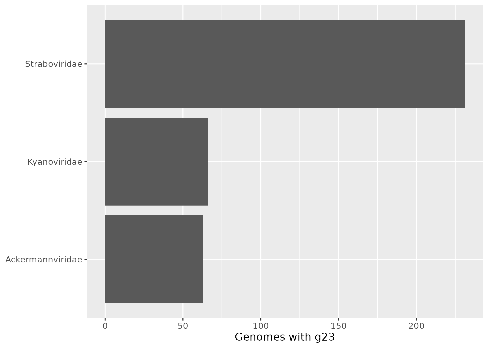
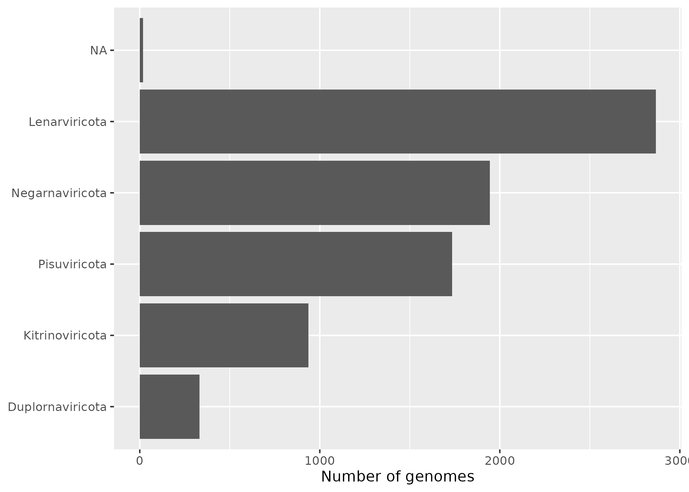

This page summarizes the taxonomic coverage, marker distribution and reference sequence composition of the current VirMarkDB release.

VirMarkDB currently integrates curated marker-gene references from three viral groups with distinct marker strategies:

- *Nucleocytoviricota*, represented by eight conserved marker genes used for multi-marker characterization;
- *Pantevenvirales*, represented by the phage capsid marker g23;
- *Orthornavirae*, represented by the RNA-dependent RNA polymerase (RdRp) marker.

For database construction and workflow details, see [Database](database.qmd) and [Workflow](workflow.qmd).

# Release summary

The current VirMarkDB release contains dynamically generated statistics from the analysis pipeline.

# Nucleocytoviricota marker coverage

*Nucleocytoviricota* genomes are represented using eight conserved marker genes selected for their phylogenetic and taxonomic relevance.

## Marker distribution across genomes

## Marker distribution across families

## Marker completeness

## Phylogenetic diversity

Phylogenetic analyses based on concatenated marker-gene alignments were performed to evaluate the coherence of selected reference sequences.

# Pantevenvirales marker coverage

*Pantevenvirales* representatives are characterized using the g23 major capsid protein marker.

# Orthornavirae marker coverage

RNA viruses are represented through the RNA-dependent RNA polymerase (RdRp) marker.

# Notes and limitations

Absence of a marker gene in VirMarkDB should not automatically be interpreted as a biological absence.

Missing marker sequences can result from incomplete genomes, marker divergence, ORF prediction limitations, annotation errors or filtering thresholds.