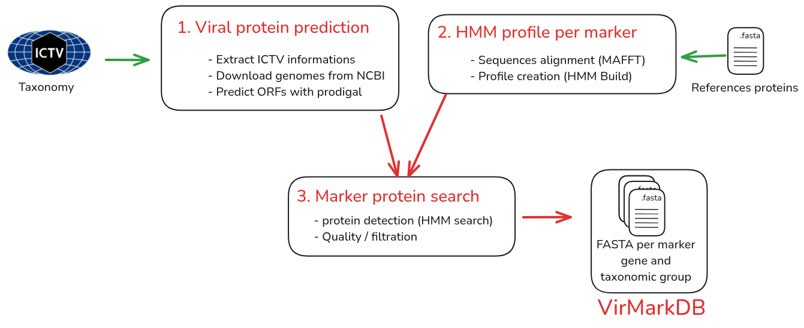
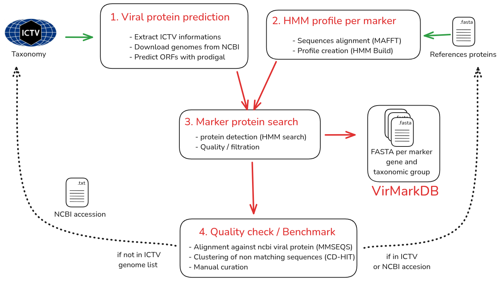

VirMarkDB documents how the database is generated, how marker-specific HMM profiles are built and applied, and how the database is refined through benchmark-guided detection of missing or underrepresented diversity. The same pipeline is applied uniformly across the three viral groups currently covered — giant viruses, phages, and RNA viruses — each genome being searched only against the marker-group profiles relevant to its taxonomic scope.

::: {.callout-note}
This pipeline runs identically for all viral groups. The branching point is `mapfile.tsv`: it assigns each marker gene to a taxonomic scope (*Nucleocytoviricota*, *Uroviricota*, or *Orthornavirae*), and uses that scope to route each genome to only the HMM profiles relevant to it. The diagram above should be read as running per scope, not globaly.
:::

## Input and provenance

### ICTV resources

The initial genome manifest and taxonomy come from the ICTV Virus Metadata Resource [VMR_MSL41.v1.20260320](https://ictv.global/sites/default/files/VMR/VMR_MSL41.v1.20260320.xlsx) (released 2026-03-20), providing virus names, ICTV identifiers, full taxonomy, GenBank accessions, genome composition, and host-source metadata.

### Additional genome inputs

Manually added genomes (not yet covered by the ICTV VMR) are listed in `input/manual_genomes_ncbi.tsv` and merged using the same taxonomy fields.

Show <code>input/manual_genomes_ncbi.tsv</code> (excerpt)

| virus_id | Family | Genus | Species | Source | Virus_names_abrv | Host_source |
|---|---|---|---|---|---|---|
| NC_075136 | Allomimiviridae | Oceanusvirus | O. kaneohense | MANUAL_NCBI | TsV1 | algae |
| PP728251 | Phycodnaviridae | Prasinovirus | P. micromonas polaris | MANUAL_NCBI | MpoV-46T | algae |
| NC_076895 | Yaraviridae | Yaravirus | Y. brasiliensis | MANUAL_NCBI | BHMG | protists |

### Marker-group configuration

`input/mapfile.tsv` is the single source of truth for which marker genes are processed against which taxonomic scopes. Each row defines one **marker group**: a marker gene, a taxonomic scope, a reference protein set, and the HMM profile built from it. The pipeline uses this file at every stage: reference preparation, HMM construction, and HMM search. So each genome is only searched against the profiles relevant to its taxonomic scope.

Show <code>input/mapfile.tsv</code>

| group_id | taxo_rank | taxo_value | marker | marker_group_id |
|---|---|---|---|---|
| nucleocytoviricota | Phylum | Nucleocytoviricota | majorcapsid | majorcapsid_nucleocytoviricota |
| nucleocytoviricota | Phylum | Nucleocytoviricota | dnapol | dnapol_nucleocytoviricota |
| nucleocytoviricota | Phylum | Nucleocytoviricota | atpase | atpase_nucleocytoviricota |
| nucleocytoviricota | Phylum | Nucleocytoviricota | primase | primase_nucleocytoviricota |
| nucleocytoviricota | Phylum | Nucleocytoviricota | rnapol1 | rnapol1_nucleocytoviricota |
| nucleocytoviricota | Phylum | Nucleocytoviricota | rnapol2 | rnapol2_nucleocytoviricota |
| nucleocytoviricota | Phylum | Nucleocytoviricota | tf2s | tf2s_nucleocytoviricota |
| nucleocytoviricota | Phylum | Nucleocytoviricota | vltf3 | vltf3_nucleocytoviricota |
| uroviricota | Phylum | Uroviricota | g23 | g23_uroviricota |
| orthornavirae | Kingdom | Orthornavirae | rdrp | rdrp_orthornavirae |

During HMM search, `genome_marker_map.tsv` resolves which genomes fall within each marker group's taxonomic scope, and therefore which profiles apply to which genome. The conceptual rationale for splitting markers this way is covered in [Database → Why marker groups exist](database.qmd#why-marker-groups-exist).

### HMM profile resources

Marker HMM profiles are built from marker-group-specific reference protein sets stored in `output/references_protein/`, sourced from three places:

| Source type | Description |
|---|---|
| Published reference datasets | Initial conserved NCLDV marker-protein reference set |
| Manual curation | Added when a marker was missing or poorly represented |
| Benchmark-guided additions | Added after benchmark analysis to improve marker coverage |

## Pipeline

::: {.pipeline-steps}

**1 · ORF prediction**: ORFs are predicted from each genome with Prodigal in metagenomic mode (`prodigal -p meta`). Script: `02_prodigal.bash`

**2 · Alignment**: Marker-group reference proteins are aligned with MAFFT (`mafft --ep 0 --genafpair`). Script: `03_align_markers.bash`

**3 · HMM profile construction**: Alignments are converted to HMM profiles with HMMER `hmmbuild`. Script: `04_hmmbuild.bash`

**4 · HMM search**: Predicted ORF proteomes are searched with `hmmsearch` against the marker-group profiles assigned via `genome_marker_map.tsv`. Script: `05_hmmsearch.bash`

**5 · Hit selection**: For each genome × marker-group pair, hits are ranked by increasing e-value then decreasing bit score. The best-ranked hit is always kept; additional hits are kept only if close to the best in both score and length. Script: `06_final_results.R`

| Filter | Threshold |
|---|---|
| Score ratio relative to best hit | ≥ 0.80 |
| Length ratio relative to best hit | ≥ 0.80 |

:::

## Quality check

VirMarkDB is benchmarked against a broader *Bamfordvirae* protein pool extracted from a local NCBI NR database, to detect marker diversity missing or underrepresented in the current release.

| Step | Description | Script |
|---|---|---|
| 1 | Extract a Bamfordvirae protein pool from NR, split by marker via title-based filters | `07_scrap_viral_protein_ncbi.bash` |
| 2 | Self-align each marker pool to flag isolated/suspicious sequences | `08_align_pool_vs_pool.bash` |
| 3 | Analyse self-alignments, filter likely misannotated proteins | `09_results_align_pool_vs_pool.R` |
| 4 | Compare filtered pool against current VirMarkDB | `10_align_pool_VirMarkDB.bash` |
| 5 | Identify proteins not covered by the current release | `11_analyse_results_align_pool_VirMarkDB.R` |
| 6 | Cluster missing proteins with CD-HIT to reduce redundancy | `12_clusterise_missing_prot.bash` |

## Software versions

| Tool | Version |
|---|---|
| R | 4.5.2 |
| Prodigal | 2.6.3 |
| MAFFT | 7.525 |
| HMMER | 3.3.2 |
| BLAST+ | 2.16.0 |
| MMseqs2 | 15.6f452 |
| CD-HIT | 4.8.1 |
